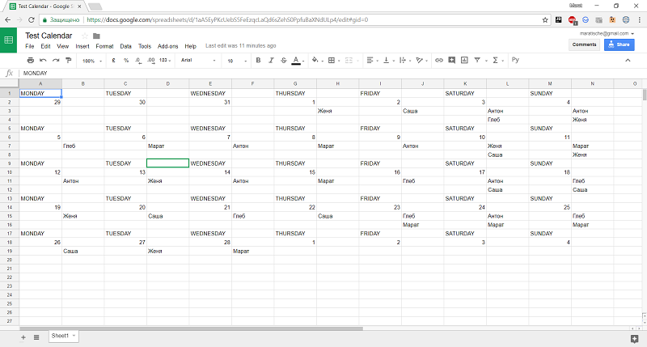

График дежурств

нам необходимо распределять график дежурств каждый месяц.
Где в рабочий день один дежурный, в выходной или праздничный - два.
Все должны дежурить одинаковое количество рабочих дней и одинаковое количество выходных и праздничных

в конфигурационном файле задается месяц,год и список дежурных, задается ссылка на google drive table документ.

Schedule of duties

We need to distribute the duty schedule every month.
Where 
on the working day there - one person on duty
on weekends or on holiday - two.
All people should be on duty the same number of working days and the same number of days off and holiday

the configuration file specifies the month, year and list of attendants, a link to the google drive table document is given.

